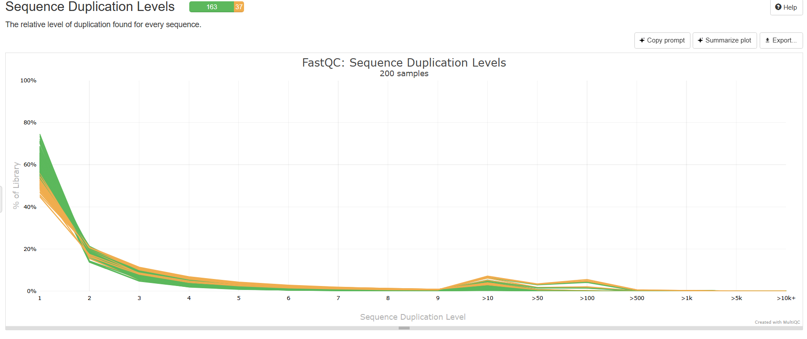

# Microbial Project
This project was done in order to be able to processes and analyzes Illumina paired-end sequencing data from 100 outbreak samples. The workflow includes raw data quality control, trimming, assembly, quality assessment, organism identification, and antimicrobial resistance profiling.

## Methodes

### Data Download
The first step was to actually download the script that would help us to download the 100 dataset, we used wget.
```
wget https://raw.githubusercontent.com/HackBio-Internship/2025_project_collection/refs/heads/main/SA_Polony_100_download.sh
```
And then changed it's mode so we can execute it easily. The output was then downloaded in another directory so we can manipulate it easily.
### Sample Preparation
Once the data is downloaded, we had to be sure that we have all the dataset and nothing is missing, for each sample we got the R1 and R2, we sorted them, and then created a loop to find if there is any sample with R1 or R2 missing
```
ls SA_Polony_data/*_1.fastq.gz \
  | sed -E 's#.*/##; s/_1\.fastq\.gz$//' \
  | sort > samples.txt
```
the loop 
```
while read S; do
  r1="SA_Polony_data/${S}_1.fastq.gz"
  r2="SA_Polony_data/${S}_2.fastq.gz"
  if [[ ! -f "$r1" ]] || [[ ! -f "$r2" ]]; then
    echo "INCOMPLETE: $S"
  fi
done < samples.txt
```
### Quality Control
Now the dataset is ready and we didn't left anything behind, we checked raw reads with FastQC and summarized with MultiQC.
```
mkdir -p qc/raw_fastqc qc/multiqc_raw
find SA_Polony_data -name "*.fastq.gz" -print0 \
 | xargs -0 -n 8 -P 8 fastqc -q -o qc/raw_fastqc
multiqc -q qc/raw_fastqc -o qc/multiqc_raw
```
### Trimming and Filtering
In order to assure a better quality, we had to trim, so we can remove the adapter and low-quality base trimming using the command fastp, then in order to compare we used another multiqc
```
while read -r S; do
  fastp \
    -i SA_Polony_data/${S}_1.fastq.gz \
    -I SA_Polony_data/${S}_2.fastq.gz \
    -o trimming/${S}_1.trim.fastq.gz \
    -O trimming/${S}_2.trim.fastq.gz \
    --detect_adapter_for_pe \
    --cut_right --cut_right_window_size 4 --cut_right_mean_quality 20 \
    --qualified_quality_phred 20 --length_required 50 \
    --thread 8 \
    -h trimming/report/${S}_fastp.html \
    -j trimming/report/${S}_fastp.json
done < samples.txt
```
### De Novo assembly
Now we are ready to actually assemblies it using SPAdes.
```
while read -r S; do
  spades.py \
    -1 trimming/${S}_1.trim.fastq.gz \
    -2 trimming/${S}_2.trim.fastq.gz \
    -o assembly/${S} \
    -t 8 -m 12
done < samples.txt
```
### Assembly Collection & Visualization
To make our work easier, we runnded a loop so we can assemble all the contigs and the fastg into another directory for further analysis and visualization (e.g., Bandage).
```
while read -r S; do
  [[ -s assembly/${S}/contigs.fasta ]] && cp assembly/${S}/contigs.fasta "contigs_ready/${S}.fasta"
  [[ -s assembly/${S}/assembly_graph.fastg ]] && cp assembly/${S}/assembly_graph.fastg "bandage_fastg/${S}.fastg"
done < samples.txt
```
### Assembly Quality Assessment
We then ran QUAST to evaluate genome assembly quality across all contigs.
```
quast.py contigs_ready/*.fasta -o quast_all --threads 8 -q
```
### Organism Identification
Representative contigs were analyzed with BLASTn against NCBI nt (remote).
Due to genome size, some contigs were split before blasting.

### Antimicrobial Resistance Profiling
We screened assemblies for AMR genes using ABRicate (ResFinder DB).


## Results
### First MultiQC


This plot shows the total number of reads per sample. Blue bars represent unique reads, while black bars indicate duplicates. Most samples have sufficient coverage for downstream assembly, although variability between samples is visible


Average read quality is generally high (>30, green zone), indicating reliable sequencing. A slight drop in quality is observed toward the end of the reads, which is typical for Illumina data.


The GC distribution peaks around ~38–40%, consistent with the genome of Listeria monocytogenes. Secondary peaks may suggest contamination or sequencing bias in some samples.


Most reads exhibit high Phred scores (>30). Very few reads fall below the acceptable threshold, confirming the dataset is overall high quality.


The proportions of A, T, G, and C stabilize across the read length after the initial bases. The small imbalance at the beginning is typical of Illumina priming and does not indicate a major problem. 


Shows the percentage of undetermined bases ("N") across all read positions. The low values confirm that base calling was accurate with minimal ambiguity.


Highlights sequences that appear more frequently than expected. Only a very small fraction (<1% of reads) are overrepresented, suggesting minimal contamination or technical artifacts.


Displays the presence of sequencing adapter sequences. The increasing signal at the end of the reads indicates some adapter contamination, which trimming tools (like fastp) are designed to remove.


Plots the read length across all samples. The sharp peak at ~300 bp reflects uniform sequencing library preparation, as expected for Illumina paired-end reads.


Indicates the percentage of duplicated reads per library. Most sequences have low duplication, but some samples show higher duplication levels, which can result from high coverage or PCR bias.
#### MultiQC summary


This heatmap provides an overview of quality metrics across all 200 samples. Each column corresponds to a QC module (e.g., per-base quality, GC content, duplication levels), and each row represents one sample. Green indicates passing QC, yellow means warnings, and red marks failures. Overall, most samples passed the key metrics, with warnings or failures mainly in GC content and duplication, which are common for bacterial genomes.
