# Unmasking Molecular Signatures of Bipolar II Disorder
## Parrt 1 : Linux (Pretreatement and Alignement)
In this part we worked on linux, in order to prepare and analyse sequencing dataset. The goal was to from raw FastQ, that we downloaded using SRA explorer files, to actually check their quality, to clean the sequences (trimming) to align them on the human genome reference whcih is (GRCh38à, and then to generate a gene count file that will be useful for further analyses using R.
### Folders organisation
We have created a clear tree structure to separate each stage of the pipeline:
```
mkdir -p project_human/{Dataset,qc,trim,reference,genomeIndex,mapped,counts,IGV}
cd project_human
```
`Dataset/` → downloaded FASTQ files

`qc/` → quality reports (FastQC/MultiQC)

`trim/` → cleaned reads (fastp)

`reference/` → genome and annotations (FASTA, GTF)

`genomeIndex/` → STAR index

`mapped/` → BAM alignments sorted by coordinates

`counts/` → count table (featureCounts)

`IGV/` → alignments + index for visualization

### Dataset downloading

The dataset is provided from the project `PRJNA1253883` (iPSC-derived microglia, healthy vs bipolar disorder). And it is available in ther EBI-ENA server.
we looked for them using SRA explorer, that gave us the code to download it.
Example of downloading using `curl` :
```
curl -L ftp://ftp.sra.ebi.ac.uk/vol1/fastq/SRR332/064/SRR33243164/SRR33243164_1.fastq.gz -o SRR33243164_1.fastq.gz
curl -L ftp://ftp.sra.ebi.ac.uk/vol1/fastq/SRR332/064/SRR33243164/SRR33243164_2.fastq.gz -o SRR33243164_2.fastq.gz
```
We've got 8 datasetm each of them got the R1 and R2.

### Quality control

Before any treatement, the quality was verified using `FastQC`
```
fastqc Dataset/*.fastq.gz -o qc/
multiqc qc/ -o qc/
```
`FastQC`: provides individual reports per file (quality, adapters, enriched sequences).
`MultiQC`: aggregates all reports into a single interactive page → easier to compare.

### Trimming and filtering 

In order to improve the quality, we use `fastp`.
```
fastp \
    -i "$r1" -I "$r2" \
    -o "trim/${base}_1.trim.fastq.gz" \
    -O "trim/${base}_2.trim.fastq.gz" \
    -h "trim/${base}_report.html" \
    -j "trim/${base}_report.json" \
    --detect_adapter_for_pe
```
And then we make another fastp to visualize the changes. 

### Reference Genome

We used the Homo sapiens genome `GRCh38` (release 109 Ensembl).
```
wget -O reference/homo_sapiens.fa.gz  ftp://ftp.ensembl.org/pub/release-109/fasta/homo_sapiens/dna/Homo_sapiens.GRCh38.dna.primary_assembly.fa.gz
wget -O reference/homo_sapiens.gtf.gz ftp://ftp.ensembl.org/pub/release-109/gtf/homo_sapiens/Homo_sapiens.GRCh38.109.gtf.gz
gunzip reference/homo_sapiens.fa.gz reference/homo_sapiens.gtf.gz
```
The `FASTA` file contains the genome sequence, and the `GTF` file describes the annotation : genes and exons.

### STAR indexation

for a fast alignement, STAR buildds the genome index.

```
STAR --runMode genomeGenerate \
     --genomeDir genomeIndex \
     --genomeFastaFiles reference/homo_sapiens.fa \
     --sjdbGTFfile reference/homo_sapiens.gtf \
     --sjdbOverhang 149 \
     --runThreadN 8
```

### Reads alignement 

each R1/R2 paires are aligned with STAR : 

```
STAR --runThreadN 8 \
       --genomeDir genomeIndex \
       --readFilesIn "$r1" "$r2" \
       --readFilesCommand zcat \
       --outFileNamePrefix mapped/${sample}_ \
       --outSAMtype BAM SortedByCoordinate \
       --outSAMattributes All
```
we then can check the verification using
`samtools flagstat mapped/*bam | head
`
### BAM indexation and IGV

in order to visualise the alignements in IGV we needed to move all `bam` files into another folder called IGV, and then index all the 8 samples using `samtools`.
```
for bam in IGV/*bam; do
  samtools index "$bam"
done
```
### Gene counting 

the counting was realised using `featureCounts` (Subread) :
```
featureCounts -T 8 -p -B -C \
  -a reference/homo_sapiens.gtf \
  -o counts/gene_counts.txt \
  mapped/*bam
```
`-p `→ paired-end mode
`-B` → correctly paired reads
`-C` → exclusion of chimeric fragments

At this point, the data is ready for differential analysis in R.

## Part 2 : R Analysis (Normalisation, PCA, DEGs, visualisations)

### Librarys needed

```
library(DESeq2)
library(pheatmap)
library(ggplot2)
```
`DESeq2`: core of differential analysis.
`pheatmap`: for visualizing expression profiles as heatmaps.
`ggplot2`: for more advanced graphics.

### Data imported

```
fc <- read.delim("gene_counts.txt", comment.char = "#", check.names = FALSE)
c_e_count <- read.delim('gene_counts.txt', header = T)
c_e_meta <- read.delim('metadata.tsv', header = T, stringsAsFactors = T)
```
`gene_counts.txt`: count table generated by featureCounts (genes in rows, SRRs in columns).
`metadata.tsv`: sample descriptions (age, clinical status, group type).
`comment.char=“#”` allows technical header lines added by featureCounts to be ignored.

### Preparation of the counting matrix

```
raw_counts <- fc[, c("Geneid", grep("^SRR", colnames(fc), value = TRUE))]
rownames(raw_counts) <- c_e_count$Geneid
raw_counts <- raw_counts[ , -1] 
```
We keep only gene column and the samples columns, add the ID of the genes like rownames, which is fundamuntal for DESeq2, and remove the GeneID because it bevame duplicated.

### Creation of DESeq2 object

```
dds <- DESeqDataSetFromMatrix(countData = raw_counts,
                              colData = c_e_meta,
                              design = ~Age + Group)
```
- countData = matrix of counts.

- colData = metadata (one sample per row).

- design = ~Age + Group = statistical model:

  -takes age into account as a covariate,

  -the main effect studied is the group (FBD, SBD, FHC, SHC).

### Reference factor

```
dds$Group <- relevel(dds$Group, ref = "SHC")
```
We defined the reference as Sporadic Healthy control, so that the log2FoldChange would be interpreted with the comparison of the different four groups.

### PCA Analysis 

Here we transformed and stabilysed the varience, in order to make the dataset comparable.

```
ggplot(pcaData, aes(PC1, PC2, color = Group, shape = Group, size = Age)) +
  geom_point(alpha = 0.8) +
  xlab(paste0("PC1: ", percentVar[1], "% variance")) +
  ylab(paste0("PC2: ", percentVar[2], "% variance")) +
  ggtitle("PCA of RNA-seq samples") +
  scale_size_continuous(range = c(3,6)) +
  theme_minimal()
```
The PCA allows us to visualise the global dataset, what it could be grouped by, the `Group` or `Age`.

### Differential results & Volcanoplot/heatmap 

```
final_res <- results(dds, contrast = c("Group", "Bipolar_disorder", "Healthy_control"), alpha = 0.05)
```
Contrast selected: `Bipolar_disorder` vs `Healthy_control`.

`alpha=0.05` = FDR threshold.

--> Each row in the table = one gene, with:

  - `log2FoldChange`: direction and intensity of the effect.

  - `pvalue` and `padj`: raw and adjusted significance.

We then plotted the volcano plot for each comparison with the group and the heat map, in order to understand the difference between them. 

### Export significative genes 

We listed the most important genes, and saved them, so we couldvisualise them and make way further analyses using ShinyGO.

## Part 3 : Results 

### Quality control (FastQC and MultiQC)

To assess the quality of the raw sequencing data, we used FastQC for each sample, followed by MultiQC to consolidate and summarize the results.

The main quality control results are presented below:

#### Mean Quality Scores

The distribution of quality scores (Phred score) across the length of the reads indicates that:

  - The values remain very high (average > 35), which corresponds to an accuracy of > 99.9%.
  - The reads are therefore reliable for downstream analysis (alignment and counting).
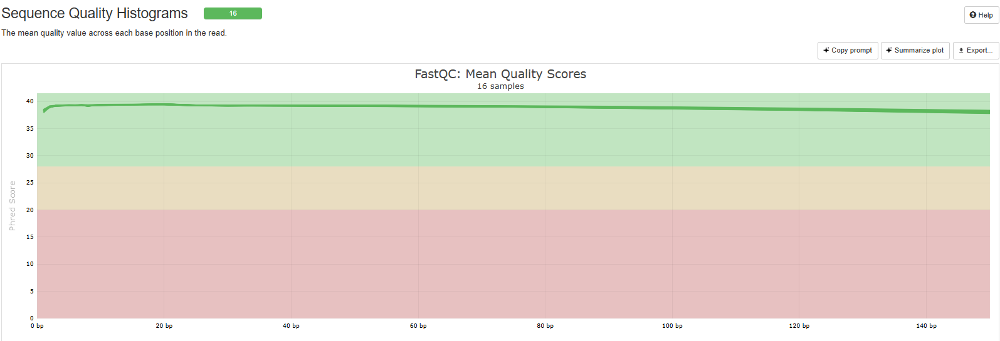

#### Sequence Duplication Levels

The duplication rate is relatively high for several samples.
Which is expected in RNA-seq, as certain highly expressed genes (e.g., housekeeping genes, ribosomal genes) produce excess reads.
After normalization (in DESeq2), this bias will not have a major impact on differential expression analyses.

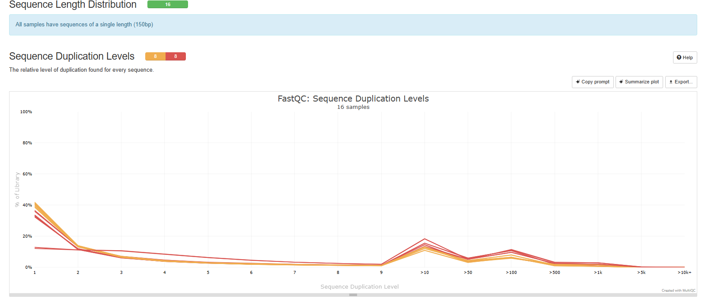

#### Per Sequence GC Content

The distribution og GC% per sample is globally in a belly format and centered betwwn 40% and 50% which is normal for humans. We can also observe some light deviations but they are still in the limit which is very good and accepted for data from RNA-Seq.

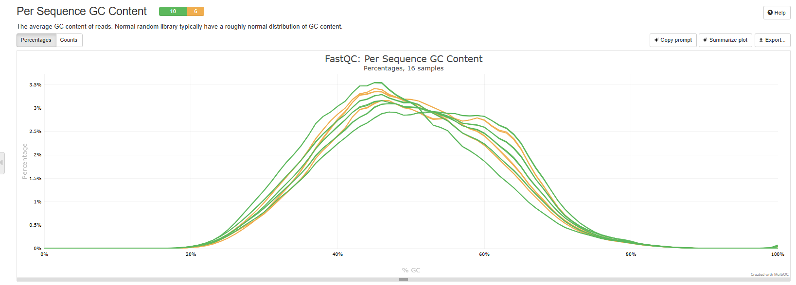

#### Adapter Content
There is a presence of adapters that was detected, but in a small amount, which justify why we choosed to trim with fastp before going onto further analysis.

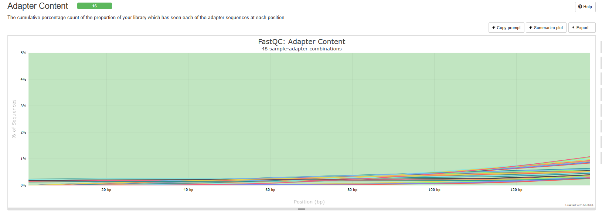

#### Global View 

Globally in this figure we can see that the majority of criterias are green which shos the global quality of the dataset and it is pretty satisfactng.
However there is modules that appears orange or even red which means respectfully to be cautions and some errors, but this observations are RNA-seq classic data where some transics too aboundount starts to duplicate.

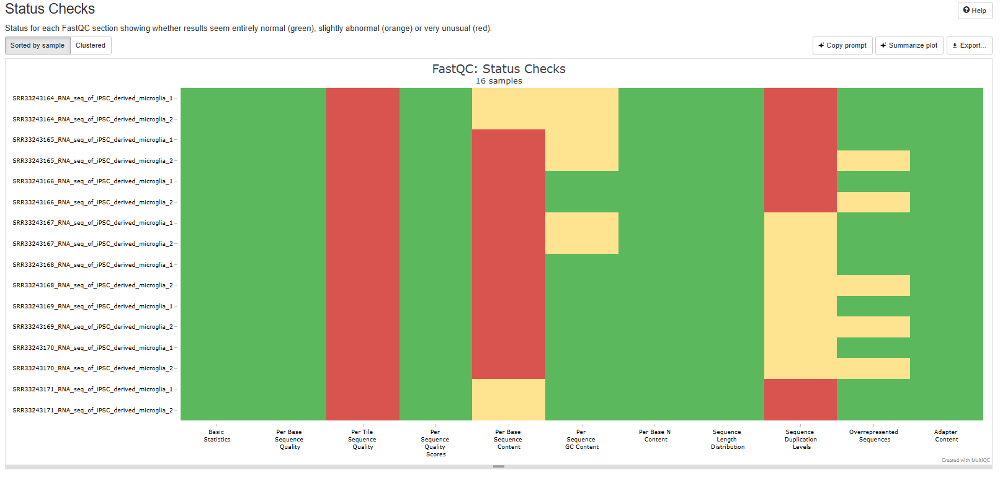

### Second Quality control (Fastp and MultiQC)

After quality filtering with Fastp, we obtained between 42 and 62 million reads per sample, with more than 99% passing filters.
The GC content was stable around 50%, consistent with human RNA-seq data.
Duplication levels were generally low (<20%) for most samples, with only one sample showing slightly elevated duplication (39%).
The percentage of residual adapter contamination was minimal (<2%).

These results confirm that the sequencing data is of high quality and suitable for downstream analysis.

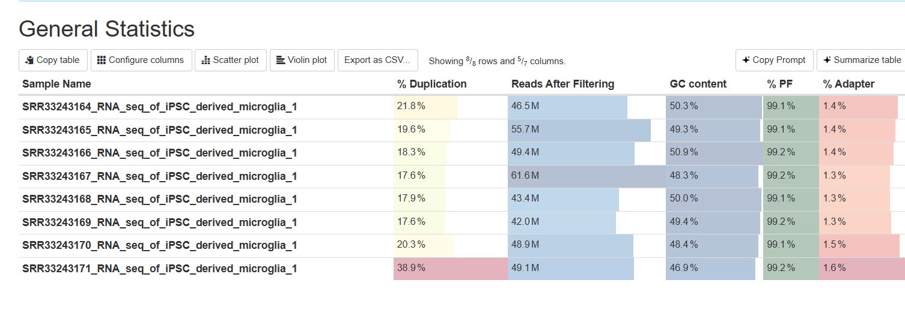

### IGV visualization

The Integrative Genomics Viewer (IGV) is a tool that allows the visualization of sequencing reads aligned to a reference genome.
Here we show an example of visualization for one healthy sample (SRR33243171) :

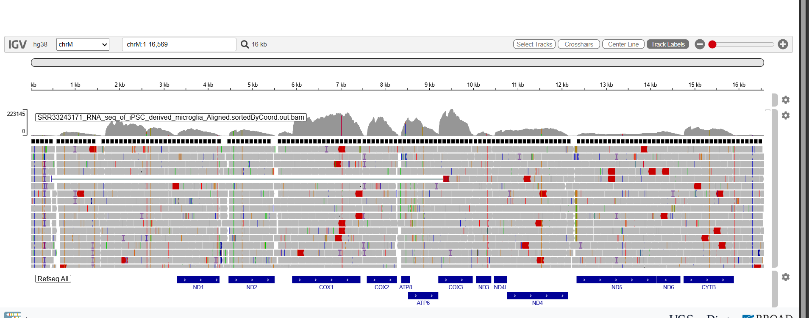

and one unhealthy sample (SRR33243164)

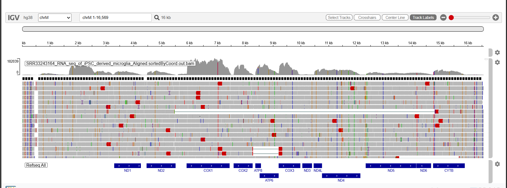

In both cases, we can clearly see the annotated mitochondrial genes (e.g., ND1, ND2, COX1, ATP6, ND5, CYTB) as well as the coverage signal (grey peaks) along the chromosome.

- Healthy sample (Figure 1): the reads align uniformly with very few mismatches.

- Unhealthy sample (Figure 2): several mismatches (red marks) appear across different mitochondrial genes.

This simple comparison illustrates the differences in alignment between healthy and unhealthy conditions.

### PCA

Principal Component Analysis (PCA) was performed to explore the variability between samples. Each point represents one sample, grouped by condition (SHC, FHC, FBD, SBD). The first two components (PC1 and PC2) explain most of the variance in the data.

This plot provides an overview of how samples cluster according to their group and age.

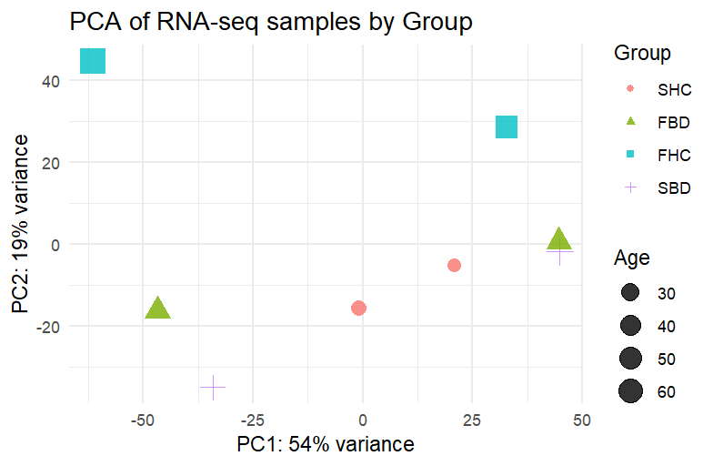

### Volcano Plots 

Volcano plots are used to visualize the results of differential expression analysis.
On the x-axis we have the log2 fold change (up- or down-regulation of genes), and on the y-axis we have the -log10 p-value (statistical significance).

- Red points represent significantly upregulated genes.
- Blue points represent significantly downregulated genes.
- Grey points are genes without significant changes.

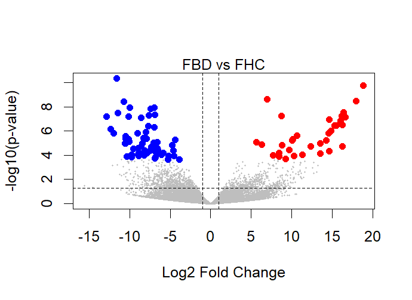

In the comparison FBD vs FHC, we observe a large number of both up- and downregulated genes, showing strong differences.

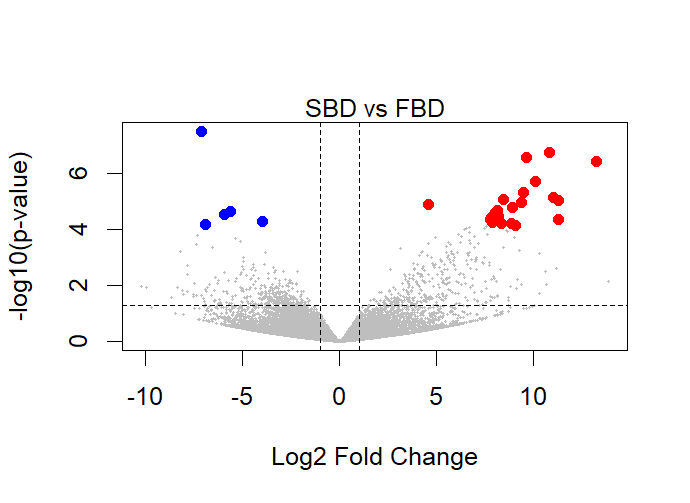

In SBD vs FBD, the number of differentially expressed genes is lower, but some remain significant.

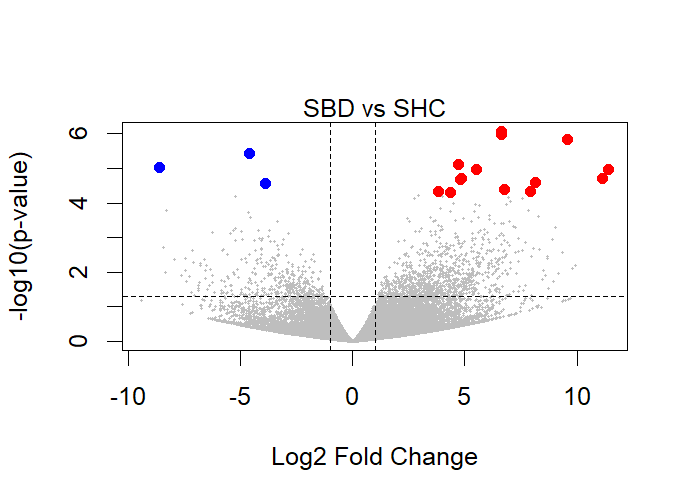

In SBD vs SHC, we see fewer changes, but still clear upregulated and downregulated genes.

### Heatmap

The heatmap shows the expression patterns of the most variable or significantly differentially expressed genes across samples.

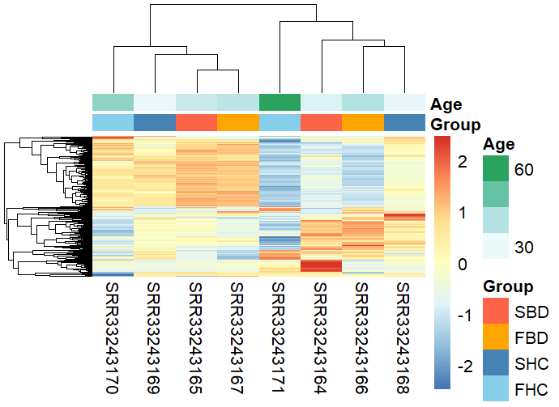

- Each row represents a gene, and each column represents a sample.

- The colors indicate relative expression levels: red = higher expression, blue = lower expression.

- The top bars show sample annotations by age and group (SBD, FBD, SHC, FHC).

### KEGG Pathway Analysis (ShinyGo Application)

KEGG pathway analysis was used to explore the biological pathways enriched among the differentially expressed genes. This allows us to see how dysregulated genes are involved in cellular functions and signaling.
The figure below shows an example for the Calcium signaling pathway in the comparison FBD vs FHC.

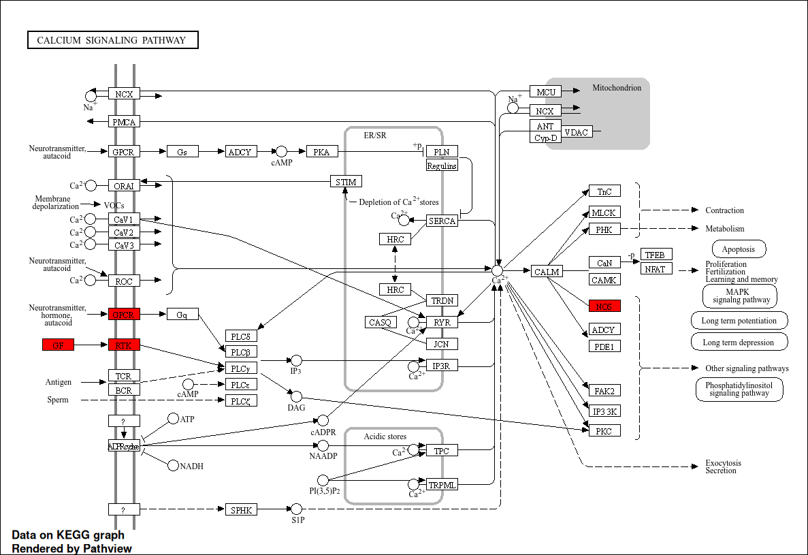

- The red boxes highlight genes that are significantly differentially expressed in our dataset.
- This pathway is important for processes such as cell communication, metabolism, and neuronal signaling.
This result illustrates how gene expression changes in FBD may impact specific biological pathways compared to healthy controls.
